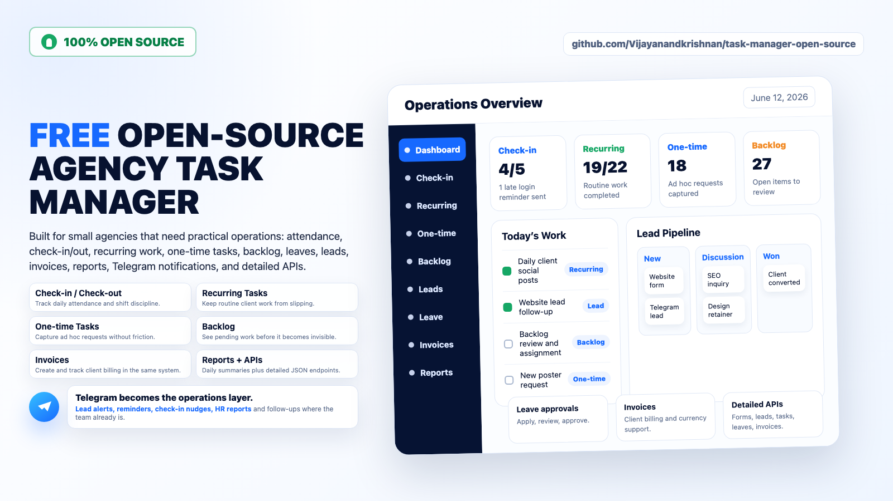

# Agency Task Manager



Open-source Flask task manager for small agencies and service teams. It combines daily work tracking, attendance, leave approvals, client/project management, invoices, sales leads, follow-ups, role permissions, reports, and optional Telegram reminders in one SQLite-backed app.

This repository is a clean source-only release. It does not include production databases, logs, secrets, backups, handoff notes, or deployment credentials.

## Features

- Employee task dashboards with recurring and one-off tasks.
- Attendance check-in/check-out, shift reminders, monthly holidays, and daily activity summaries.
- Leave application workflow with admin approval permissions.
- Lead management with stages, follow-ups, public form intake, Telegram intake, and WhatsApp webhook intake.
- Lead conversion into clients.
- Client, project, invoice, currency, and company profile management.
- Role and permission management, including sales/accountant/admin/superadmin flows.
- Telegram notifications for HR reports, sales lead reminders, celebrations, and attendance events.
- JSON APIs for leads, intake sources, employees, clients, projects, tasks, invoices, attendance, leave, settings, comments, and notifications.

## Documentation

- [Complete Feature Guide](docs/FEATURE_GUIDE.md)

## Quick Start

```bash
python3 -m venv .venv
source .venv/bin/activate
pip install -r requirements.txt

export SECRET_KEY="$(python3 -c 'import secrets; print(secrets.token_hex(32))')"
export TASK_MANAGER_DISABLE_SCHEDULER=1

python app.py
```

Open `http://localhost:5050`.

On first run the app creates a local `tasks.db` SQLite database and generates initial `admin` and `superadmin` accounts. The generated passwords are printed once in the terminal logs. For predictable first-run credentials, set these before the first start:

```bash
export INITIAL_ADMIN_PASSWORD="change-this-admin-password"
export INITIAL_OWNER_PASSWORD="change-this-superadmin-password"
```

The app forces password change after first login.

## Environment

Copy `.env.example` into your deployment system or export the variables directly. The app does not require a `.env` loader by default.

Important variables:

- `SECRET_KEY`: Flask session secret. Use a long random value in production.
- `COOKIE_SECURE`: use `true` behind HTTPS, or keep `auto` for the app default.
- `INITIAL_ADMIN_PASSWORD`: optional password for first generated admin.
- `INITIAL_OWNER_PASSWORD`: optional password for first generated superadmin.
- `TELEGRAM_BOT_TOKEN`: optional Telegram bot token.
- `TELEGRAM_GROUP_CHAT_ID`: optional general team Telegram chat id.
- `TELEGRAM_ACCOUNTANT_CHAT_ID`: optional finance/accountant Telegram chat id.
- `TASK_MANAGER_DISABLE_SCHEDULER`: set `1` to disable background reminders and reports.

## API Overview

The app includes authenticated JSON APIs under `/api/v1` and public intake endpoints protected by source tokens.

- Lead intake sources: `/api/v1/lead-intake/sources`
- Public form intake: `/api/v1/lead-intake/<token>`
- Telegram intake: `/api/v1/lead-intake/telegram/<token>`
- WhatsApp intake: `/api/v1/lead-intake/whatsapp/<token>`
- Leads and stages: `/api/v1/leads`, `/api/v1/leads/stages`, `/api/v1/leads/stats`
- Lead history/follow-ups/conversion: `/api/v1/leads/<id>/history`, `/api/v1/leads/<id>/followups`, `/api/v1/leads/<id>/convert`
- Roles and permissions: `/api/v1/roles`, `/api/v1/roles/<role>/permissions`
- Employees: `/api/v1/employees`
- Clients: `/api/v1/clients`
- Projects: `/api/v1/projects`
- Tasks: `/api/v1/tasks/recurring`, `/api/v1/tasks/oneoff`
- Invoices: `/api/v1/invoices`
- Attendance: `/api/v1/attendance`
- Leave: `/api/v1/leave-types`, `/api/v1/leaves`
- Activity, settings, comments, notifications: `/api/v1/activity-log`, `/api/v1/settings`, `/api/v1/comments`, `/api/v1/notifications`
- Health checks: `/api/health`, `/api/health/full`

## Deployment Helper

`setup_instance.sh` is a simple Linux/systemd helper:

```bash
sudo ./setup_instance.sh acme-agency 5051 tasks.example.com
```

It copies the checked-out source into `/opt/task-manager-<client>`, creates a virtual environment, installs requirements, writes a systemd service, and optionally creates an Nginx reverse proxy config. Review the generated service file before exposing it publicly.

## Data Safety

Generated runtime files are ignored by Git:

- `tasks.db`, SQLite WAL/SHM files, and other database files
- `.secret_key`
- `.env`
- logs
- backups
- Python caches

Before publishing a fork, run:

```bash
find . -maxdepth 3 \( -name "*.db" -o -name ".secret_key" -o -name "*.log" -o -name "*.bak" \) -print
```

The command should print nothing for a clean source release.

## License

MIT License. See `LICENSE`.
